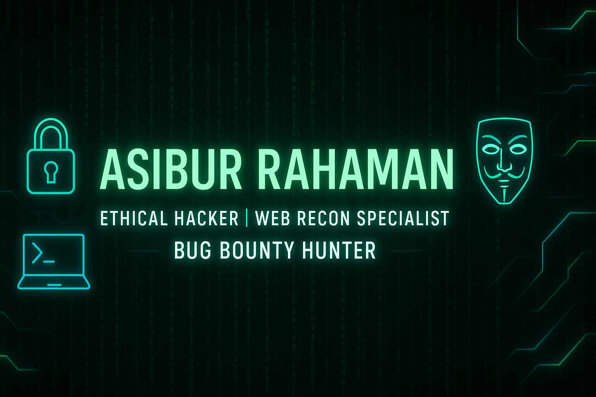

<!-- 🖼️ Banner -->

  

<h1 align="center">🧑‍💻 Asibur Rahaman</h1>

  <strong>🔐 Ethical Hacker | 🕵️ Web Application Pentester | 🧠 Red Team Enthusiast</strong> 
  🔗 <a href="https://github.com/Asibur-syber">github.com/Asibur-syber</a>

  

---

### 🧠 About Me

🚀 I'm an aspiring *Cybersecurity Professional* with deep hands-on skills in Linux, Web Pentesting, and Red Team tools.  
🎯 My goal is to earn through skill — building *GitHub portfolio*, writing *client-grade reports*, and solving *real-world CTFs*.

- 🛠️ Tools Mastered: Nmap, Burp Suite, SQLMap, Dirb, Wireshark, Hydra, Netcat  
- 💻 Platforms: TryHackMe (40+ Rooms), Kali Linux, GitHub, Bug Bounty  
- 🧾 Speciality: Clear & Concise Pentesting Reports with step-by-step breakdowns  
- 💼 Available for: Freelance | Report Writing | Mentorship  
- 📈 Target: 1 lakh+ BDT/month using skills, not certificates

---

### 🧰 My Skill Arsenal

---

### 📂 Featured Projects

| 🔐 Project | 📄 Description |
|-----------|----------------|
| [**THM Reports**](Asibur-syber/TryHackMe-Reports) | 40+ Complete TryHackMe Room Writeups with Tools, Screenshots, and Methodologies |
| [**DVWA Pentest**](https://github.com/Asibur-syber/DVWA-Pentest) | Full penetration testing breakdown of DVWA (Damn Vulnerable Web App) |
| [**Bug Bounty Notes**](https://github.com/Asibur-syber/Bug-Bounty-Notes) | Recon techniques, tool commands, and exploitation notes — organized for bounty hunting |

---

### 🧾 Fiverr Ready Services

✅ Custom Penetration Testing Report  
✅ Web Reconnaissance & Vulnerability Summary  
✅ TryHackMe Room Report Writing (Markdown / PDF)  
✅ Bug Bounty Note Structuring  
🔗 Fiverr Portfolio: [Visit Fiverr](https://www.fiverr.com/)

---

### 📊 GitHub Stats

  
   
  

---

### 🔗 Connect With Me

---

### 🧠 Quote I Live By:

“Every vulnerability is a window of opportunity.” — *Asibur Rahaman*

---
